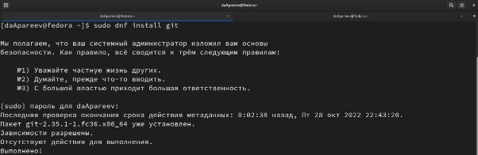
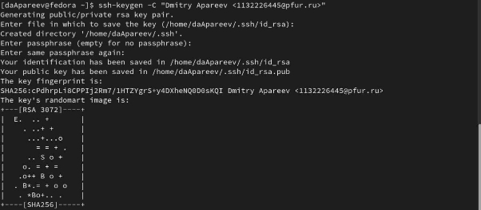
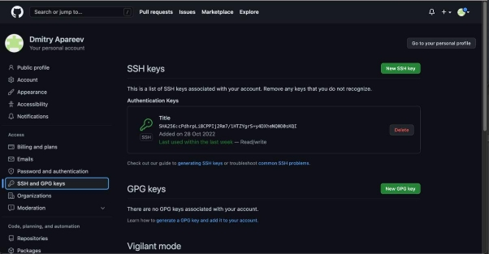
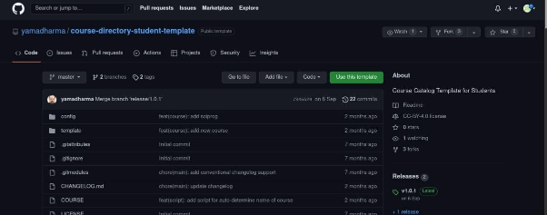
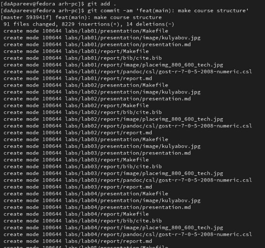
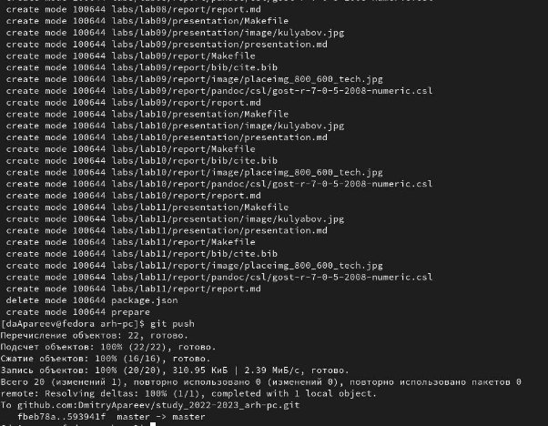
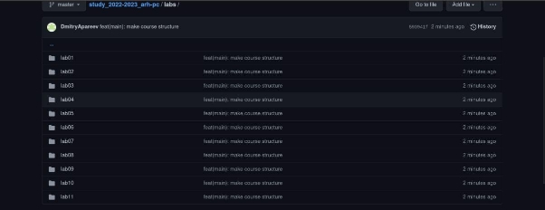

**РОССИЙСКИЙ УНИВЕРСИТЕТ ДРУЖБЫ НАРОДОВ** 

**Факультет физико-математических и естественных наук Кафедра компьютерных и информационных наук** 

**ОТЧЕТ** 

**по лабораторной работе №3** 

*дисциплина:  Архитектура компьютера и операционные* 

*системы*  

Студент:  Апареев Дмитрий Андреевич                                  

Группа: НКАбд-01-22 

№ ст. билета: 1132226445                                   

**МОСКВА** 

2022 г. 

**Цель лабораторной работы** 

Целью данной работы является изучить идеологию и применение средств       контроля версий, а также приобрести практические навыки по работе с системой git.

**Выполнение лабораторной работы**  

Для выполнения лабораторной работы необходимо установить систему контроля версий, для этого я выбрал git (рисунок 1.1)

Рисунок 1.1. Установка git  

После чего регистрируюсь на сайте github и заполняю все необходимые данные (настраиваю профиль). 

Сначала  сделаю  предварительную  конфигурацию  git.  Через  терминал  ввожу команды (Рисунок 1.2) , указывая почту и имя владельца репозитория 

Рисунок 1.2. Указание имени и почты владельца Настроим utf-8 в выводе сообщений git (рисунок 1.3).  

Рисунок 1.3. Настройка utf-8 

Задаю имя начальной ветки, параметр autocrlf и safecrlf (рисунок 1.4-1.6) 

Рисунок 1.4. Имя начальной ветки 

Рисунок 1.5. Параметр autocrlf 

Рисунок 1.6. Параметр safecrlf 

Для  последующей  идентификации  пользователя  на  сервере  репозиториев необходимо сгенерировать пару ключей (рисунок 1.7) 

Рисунок 1.7. Создание ключей 

Ключи сохраняться в каталоге ~/.ssh/. Далее нужно сгенерировать открытый ключ на github (рисунок 1.8)

Рисунок 1.8. Сгенерированный ключ на github 

Откроем терминал и создадим каталог для предмета «Архитектура компьютера» 

(рисунок 1.9) 

Рисунок 1.9. Создание каталога 

Репозиторий на основе шаблона можно создать через web-интерфейс github. Нажимая на кнопку use this template копируем шаблон. В открывшемся окне задаем имя репозитория (Repository name) study\_2022–2023\_arh-pc и создаем репозиторий (кнопка Create repository from template). (рисунок 1.10)

Рисунок 1.10. Использование шаблона 

Откроем терминал и перейдем в каталог курса, после чего клонируем созданный репозиторий, ссылку для клонирования можно скопировать на странице созданного репозитория Code -> SSH: (рисунок 1.11) 

Рисунок 1.11. Клонирование репозитория 

Перейдем в каталог курса и удалим лишние файлы (рисунок 1.13-1.14) 

Рисунок 1.12. Переход в каталог курса 

Рисунок 1.13. Удаление файла 

После, создаем необходимые каталоги и отправляем файлы на сервер (Рисунок 

1.14-1.16) 

Рисунок 1.14. Создание курса 

Рисунок 1.15. Отправка файлов на сервер

Рисунок 1.16. Отправка файлов на сервер (2) 

Проверяем правильность выполнения, убеждаемся в правильности и пользуемся. (рисунок 1.17)  

Рисунок 1.17. Проверка на github 

**Задания для самостоятельной работы** 

Изначально я копирую 1 лабораторную работу с помощью cp в папку report для первой лабораторной работы и проверяю правильность выполнение через ls (рисунок 2.1) 

Рисунок 2.1. Копирование 1 лабораторной работы в папку report 

Для передачи файла перехожу в папку report с помощью cd и добавляю файл с 1 лабораторной работой в git с помощью git add (рисунок 2.2) 

Рисунок 2.2. передача файла в git 

Аналогичные действия провожу для 2 лабораторной работы (рисунок 2.3-2.4) 

Рисунок 2.3 Копирование 2 лабораторной работы в папку report Рисунок 2.4 передача файла в git 

Аналогично с 3 лабораторной работой (рисунок 2.5-2.6)

Рисунок 2.5 Копирование 3 лабораторной работы в папку report 

Рисунок 2.6 передача файлов в git 

Сохраняю изменения на сервере командой git commit -m “…”, поясняя, что добавил файлы (рисунок 2.7)

Рисунок 2.7 сохранение изменений 

С помощью команды git push -f origin master выгружаю изменения в центральный репозиторий (рисунок 2.8) 

Рисунок 2.8 отправка изменений в центральный репозиторий 

**Вывод**  

При выполнении данной лабораторной работы я изучил идеологию и применение средств контроля версий, а также приобрел практические навыки по работе с системой git. 
