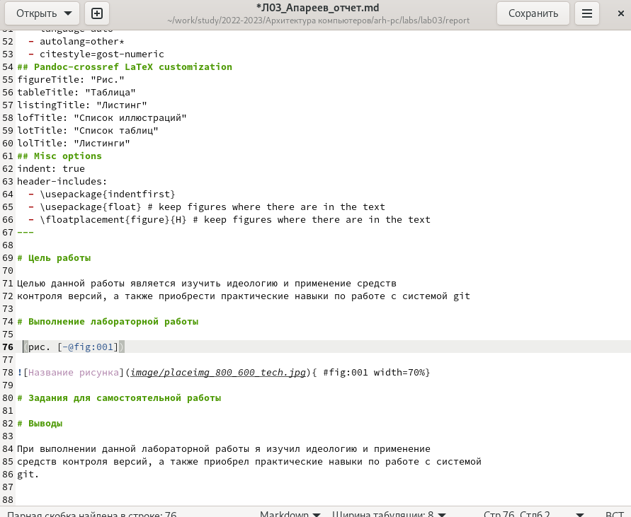

---
## Front matter
title: "Лабораторная работа №4"
subtitle: "Дисциплина: Архитектура компьютера"
author: "Апареев Дмитрий Андреевич"

## Generic otions
lang: ru-RU
toc-title: "Содержание"

## Bibliography
bibliography: bib/cite.bib
csl: pandoc/csl/gost-r-7-0-5-2008-numeric.csl

## Pdf output format
toc: true # Table of contents
toc-depth: 2
lof: true # List of figures
lot: true # List of tables
fontsize: 12pt
linestretch: 1.5
papersize: a4
documentclass: scrreprt
## I18n polyglossia
polyglossia-lang:
  name: russian
  options:
	- spelling=modern
	- babelshorthands=true
polyglossia-otherlangs:
  name: english
## I18n babel
babel-lang: russian
babel-otherlangs: english
## Fonts
mainfont: PT Serif
romanfont: PT Serif
sansfont: PT Sans
monofont: PT Mono
mainfontoptions: Ligatures=TeX
romanfontoptions: Ligatures=TeX
sansfontoptions: Ligatures=TeX,Scale=MatchLowercase
monofontoptions: Scale=MatchLowercase,Scale=0.9
## Biblatex
biblatex: true
biblio-style: "gost-numeric"
biblatexoptions:
  - parentracker=true
  - backend=biber
  - hyperref=auto
  - language=auto
  - autolang=other*
  - citestyle=gost-numeric
## Pandoc-crossref LaTeX customization
figureTitle: "Рис."
tableTitle: "Таблица"
listingTitle: "Листинг"
lofTitle: "Список иллюстраций"
lotTitle: "Список таблиц"
lolTitle: "Листинги"
## Misc options
indent: true
header-includes:
  - \usepackage{indentfirst}
  - \usepackage{float} # keep figures where there are in the text
  - \floatplacement{figure}{H} # keep figures where there are in the text
---

# Цель работы

Целью данной лабораторной работы является освоение процедуры оформления отчетов с помощью языка разметки markdown

# Задание

1.Установка необходимого ПО
2.Заполнение отчета по выполнению лабораторной работы №4 с помощью языка разметки Markdown
3.Задание для самостоятельной работы

# Теоретическое введение

Markdown - легковесный язык разметки, созданный с целью обозначения форматирования в простом тексте, с максимальным сохранением его читаемости человеком, и пригодный для машинного преобразования в языки для продвинутых публикаций. Внутритекстовые формулы делаются аналогично формулам LaTeX. В Markdown вставить изображение в документ можно с помощью непосредственного указания адреса изображения. Синтаксис Markdown для встроенной ссылки состоит из части [link text], представляющей текст гиперссылки, и части (file-name.md) – URL-адреса или имени файла, на который дается ссылка. Markdown поддерживает как встраивание фрагментов кода в предложение, так и их размещение между предложениями в виде отдельных огражденных блоков. Огражденные блоки кода — это простой способ выделить синтаксис для фрагментов код

# Выполнение лабораторной работы

# Установление необходимого ПО

 Сначала скачал texlive и распаковал его, затем пошел процесс установки с правами root(рис.1 [-@fig:001])
{ #fig:001 width=70% }

После, добавляю в свой PATH для текущей и будущих сессий(рис.2 [-@fig:002])
{ #fig:002 width=70% }

Скачиваю архив pandoc версии 2.18. (рис.3 [-@fig:003]).
{ #fig:003 width=70% }

Скачиваю pandoc-crossref(рис.4 [-@fig:004]).
{ #fig:004 width=70% }

Распаковываю архивы pandoc, pandoc-crossref аналогично(рис.5 [-@fig:005]).
{ #fig:005 width=70% }

Переношу pandoc и pandoc-crossref в удобный путь(рис.6 [-@fig:006]).
{ #fig:006 width=70% }

Перехожу в папку arh-pc и обновляю git(рис.7 [-@fig:007]).
{ #fig:007 width=70% }

После перехожу в папку report четвертой лабораторной работы(рис.8 [-@fig:008]).
{ #fig:008 width=70% } 

Далее создаю файлы отчета в docx и pdf с помощью make(рис.9 [-@fig:009]).
{ #fig:009 width=70% } 

Открываю файл report.md с помощью любого текстового редактора gedit. Компилирую файл с отчетом. Загружаю отчет на GitHub.

# Задания для самостоятельной работы

Копирую содержимое report в Л03-Апареев_отчет (рис.10 [-@fig:010]).
{ #fig:010 width=70% } 

Редактирую файл md (рис.11 [-@fig:011]).
{ #fig:011 width=70% } 

Создаю файлы docx pdf по отчету лабораторной работы (рис.12 [-@fig:012]).
{ #fig:012 width=70% } 

Добавляю файлы в git 
Сохраняю файлы в git 
Отправляю файлы на сервер (рис.13 [-@fig:013]).
{ #fig:013 width=70% } 

# Вывод

В результате выполнения данной лабораторной работы я освоил процедуры оформления отчетов с помощью языка разметки Markdown.
