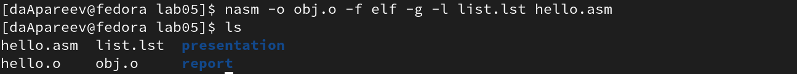
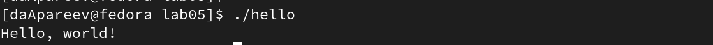

---
## Front matter
title: "Лабораторная работа №5"
subtitle: "Дисциплина: Архитектура компьютера"
author: "Апареев Дмитрий Андреевич"

## Generic otions
lang: ru-RU
toc-title: "Содержание"

## Bibliography
bibliography: bib/cite.bib
csl: pandoc/csl/gost-r-7-0-5-2008-numeric.csl

## Pdf output format
toc: true # Table of contents
toc-depth: 2
lof: true # List of figures
lot: true # List of tables
fontsize: 12pt
linestretch: 1.5
papersize: a4
documentclass: scrreprt
## I18n polyglossia
polyglossia-lang:
  name: russian
  options:
	- spelling=modern
	- babelshorthands=true
polyglossia-otherlangs:
  name: english
## I18n babel
babel-lang: russian
babel-otherlangs: english
## Fonts
mainfont: PT Serif
romanfont: PT Serif
sansfont: PT Sans
monofont: PT Mono
mainfontoptions: Ligatures=TeX
romanfontoptions: Ligatures=TeX
sansfontoptions: Ligatures=TeX,Scale=MatchLowercase
monofontoptions: Scale=MatchLowercase,Scale=0.9
## Biblatex
biblatex: true
biblio-style: "gost-numeric"
biblatexoptions:
  - parentracker=true
  - backend=biber
  - hyperref=auto
  - language=auto
  - autolang=other*
  - citestyle=gost-numeric
## Pandoc-crossref LaTeX customization
figureTitle: "Рис."
tableTitle: "Таблица"
listingTitle: "Листинг"
lofTitle: "Список иллюстраций"
lotTitle: "Список таблиц"
lolTitle: "Листинги"
## Misc options
indent: true
header-includes:
  - \usepackage{indentfirst}
  - \usepackage{float} # keep figures where there are in the text
  - \floatplacement{figure}{H} # keep figures where there are in the text
---

# Цель работы

Цель данной лабораторной работы - освоить процедуры компиляции и сборки программ, написанных на ассемблере NASM.

# Задание

1. Создание программы Hello world!
2. Работа с транслятором NASM
3. Работа с расширенным синтаксисом командной строки NASM
4. Работа с компоновщиком LD
5. Запуск исполняемого файла
6. Выполнение заданий для самостоятельной работы.

# Выполнение лабораторной работы

 С помощью  cd пемещаюсь в каталог, в котором буду работать(рис.1 [-@fig:001])
{ #fig:001 width=70% }

Создаю в текущем каталоге пустой текстовый файл hello.asm с помощью touch(рис.2 [-@fig:002])
{ #fig:002 width=70% }

Открываю созданный файл в текстовом редакторе getid и вставляю в файл программу для вывода "Hello word!"(рис.3 [-@fig:003]).
{ #fig:003 width=70% }

Скачиваю необходимые файлы (рис.4 [-@fig:004]).
{ #fig:004 width=70% }

Превращаю текст программы для вывода "Hello world!" в объектный код с помощью транслятора NASM, используя команду nasm -f elf hello.asm(рис.5 [-@fig:005]).
{ #fig:005 width=70% }

Ввожу команду, которая скомпилирует файл hello.asm в файл obj.o, при этом в файл будут включены символы для отладки, также с помощью ключа -l будет создан файл list.lst (рис.6 [-@fig:006]).
{ #fig:006 width=70% }

Передаю объектный файл hello.o на обработку компоновщику LD, чтобы получить исполняемый файл hello
{ #fig:007 width=70% }

Ввожу следующую команду:(рис.8 [-@fig:008]). Исполняемый файл будет иметь имя main, т.к. после ключа -о было задано значение main. Объектный файл, из которого собран этот исполняемый файл, имеет имя obj.o
{ #fig:008 width=70% } 

Запускаю на выполнение созданный исполняемый файл, находящийся в
текущем каталоге (рис.9 [-@fig:009]).
{ #fig:009 width=70% } 

Открываю файл report.md с помощью любого текстового редактора gedit. Компилирую файл с отчетом. Загружаю отчет на GitHub.

# Задания для самостоятельной работы

С помощью утилиты cp создаю в текущем каталоге копию файла hello.asm с именем lab5.asm (рис.10 [-@fig:010]).
{ #fig:010 width=70% } 

Редактирую текст файла(рис.12 [-@fig:012]).
{ #fig:012 width=70% } 

Компилирую текст программы в объектный файл (рис.12 [-@fig:012]).
{ #fig:012 width=70% } 

Передаю объектный файл lab5.o на обработку компоновщику LD (рис.13 [-@fig:013]).
{ #fig:013 width=70% } 

Запускаю исполняемый файл lab5 (рис.14 [-@fig:013]).
{ #fig:014 width=70% } 

Добавляю файлы в git , Сохраняю файлы в git , Отправляю файлы на сервер 

# Вывод

При выполнении данной лабораторной работы я освоил процедуры компиляции и сборки программ, написанных на ассемблере NASM.

