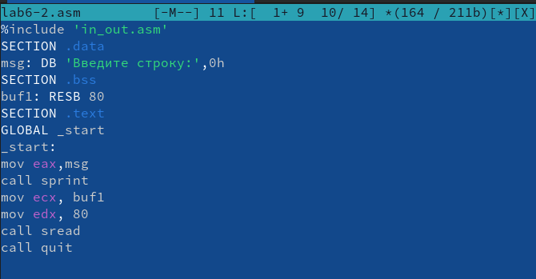
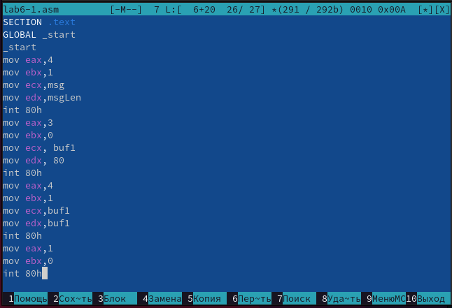

---
## Front matter
title: "Лабораторная работа №6"
subtitle: "Дисциплина: Архитектура компьютера"
author: "Апареев Дмитрий Андреевич"

## Generic otions
lang: ru-RU
toc-title: "Содержание"

## Bibliography
bibliography: bib/cite.bib
csl: pandoc/csl/gost-r-7-0-5-2008-numeric.csl

## Pdf output format
toc: true # Table of contents
toc-depth: 2
lof: true # List of figures
lot: true # List of tables
fontsize: 12pt
linestretch: 1.5
papersize: a4
documentclass: scrreprt
## I18n polyglossia
polyglossia-lang:
  name: russian
  options:
	- spelling=modern
	- babelshorthands=true
polyglossia-otherlangs:
  name: english
## I18n babel
babel-lang: russian
babel-otherlangs: english
## Fonts
mainfont: PT Serif
romanfont: PT Serif
sansfont: PT Sans
monofont: PT Mono
mainfontoptions: Ligatures=TeX
romanfontoptions: Ligatures=TeX
sansfontoptions: Ligatures=TeX,Scale=MatchLowercase
monofontoptions: Scale=MatchLowercase,Scale=0.9
## Biblatex
biblatex: true
biblio-style: "gost-numeric"
biblatexoptions:
  - parentracker=true
  - backend=biber
  - hyperref=auto
  - language=auto
  - autolang=other*
  - citestyle=gost-numeric
## Pandoc-crossref LaTeX customization
figureTitle: "Рис."
tableTitle: "Таблица"
listingTitle: "Листинг"
lofTitle: "Список иллюстраций"
lotTitle: "Список таблиц"
lolTitle: "Листинги"
## Misc options
indent: true
header-includes:
  - \usepackage{indentfirst}
  - \usepackage{float} # keep figures where there are in the text
  - \floatplacement{figure}{H} # keep figures where there are in the text
---

# Цель работы

Целью данной лабораторной работы является приобретение практических навыков работы в Midnight Commander, освоение инструкций языка ассемблера mov и int.

# Задание

1. Основы работы с mc
2. Структура программы на языке ассемблера NASM
3. Подключение внешнего файла
4. Выполнение заданий для самостоятельной работы

# Выполнение лабораторной работы

Открываю Midnight Commander, введя в терминал mc (рис. [-@fig:001]).

{ #fig:001 width=70% }

Перехожу в каталог ~/work/study/2022-2023/Архитектура Компьютера/arch-pc, используя файловый менеджер mc (рис. [-@fig:002])

{ #fig:002 width=70% }

С помощью функциональной клавиши F7 создаю каталог lab06 и перехожу в него(рис. [-@fig:003]).

{ #fig:003 width=70% }

В строке ввода прописываю команду touch lab6-1.asm, чтобы создать файл, в котором буду работать (рис. [-@fig:004]).

{ #fig:004 width=70% }

С помощью функциональной клавиши F4 открываю созданный файл для редактирования в редакторе. Ввожу в файл код программы для запроса строки у пользователя (рис. [-@fig:005]). Далее выхожу из файла, сохраняя изменения (рис. [-@fig:005]).

{ #fig:005 width=70% }

С помощью функциональной клавиши F3 открываю файл для просмотра, чтобы проверить, содержит ли файл текст программы (рис.6 [-@fig:006]).

{ #fig:006 width=70% }

Транслирую текст программы файла в объектный файл командой nasm -f elf lab6-1.asm. Создался объектный файл lab6-1.o. Выполняю компоновку объектного файла с помощью команды ld -m elf_i386 -o lab6-1 lab6-1.o. Создался исполняемый файл lab6-1. Запускаю исполняемый файл. Программа выводит строку "Введите строку: " и ждет ввода с клавиатуры, я ввожу свои ФИО, на этом программа заканчивает свою работу

{ #fig:007 width=70% }

С помощью функциональной клавиши F5 копирую файл in_out.asm из каталога Загрузки в созданный каталог lab06

{ #fig:008 width=70% } 

С помощью функциональной клавиши F5 копирую файл lab6-1 в тот же каталог, но с другим именем, для этого в появившемся окне mc прописываю имя для копии файла (рис.9 [-@fig:009]).

!(image/9.png){ #fig:009 width=70% } 

Изменяю содержимое файла lab6-2.asm во встроенном редакторе nano, чтобы в программе использовались подпрограммы из внешнего файла in_out.asm. Транслирую текст программы файла в объектный файл командой nasm -f elf lab6-2.asm. Создался объектный файл lab6-2.o. Выполняю компоновку объектного файла с помощью команды ld -m elf_i386 -o lab6-2 lab6-2.o Создался исполняемый файл lab6-2. Запускаю исполняемый файл (рис. [-@fig:010]).

{ #fig:010 width=70% } 

Открываю файл lab6-2.asm для редактирования в nano функциональной клавишей F4. Изменяю в нем подпрограмму sprintLF на sprint. Сохраняю изменения и открываю файл для просмотра, чтобы проверить сохранение действий (рис. [-@fig:011]).

{ #fig:011 width=70% } 

Снова транслирую файл, выполняю компоновку созданного объектного файла, запускаю новый исполняемый файл. Разница между первым исполняемым файлом lab6-2 и вторым lab6-2-2 в том, что запуск первого запрашивает ввод с новой строки, а программа, которая исполняется при запуске второго, запрашивает ввод без переноса на новую строку, потому что в этом заключается различие между подпрограммами sprintLF и sprint.

Открываю файл report.md с помощью любого текстового редактора gedit. Компилирую файл с отчетом. Загружаю отчет на GitHub.

# Задания для самостоятельной работы

Создаю копию файла lab6-1.asm с именем lab6-1-1.asm с помощью функциональной клавиши F(рис.[-@fig:012])

{ #fig:012 width=70% } 

С помощью функциональной клавиши F4 открываю созданный файл для редактирования. Изменяю программу так, чтобы кроме вывода приглашения и запроса ввода, она выводила вводимую пользователем строку (рис.[-@fig:013]).

{ #fig:013 width=70% } 

Создаю объектный файл lab6-1-1.o, отдаю его на обработку компоновщику, получаю исполняемый файл lab6-1-1, запускаю полученный исполняемый файл. Программа запрашивает ввод, ввожу свои ФИО, далее программа выводит введенные мною данные (рис.[-@fig:014]).

{ #fig:014 width=70% } 

Создаю копию файла lab6-2.asm с именем lab6-2-1.asm с помощью функциональной клавиши F5 (рис.15[-@fig:015]).

{ #fig:015 width=70% } 

С помощью функциональной клавиши F4 открываю созданный файл для редактирования. Изменяю программу так, чтобы кроме вывода приглашения и запроса ввода, она выводила вводимую пользователем строку (рис. [-@fig:016]).

{ #fig:016 width=70% } 

Создаю объектный файл lab6-2-1.o, отдаю его на обработку компоновщику, получаю исполняемый файл lab6-2-1, запускаю полученный исполняемый файл. Программа запрашивает ввод без переноса на новую строку, ввожу свои ФИО, далее программа выводит введенные мною данные рис. [-@fig:017]).

{ #fig:017 width=70% } 

Добавляю файлы в git , Сохраняю файлы в git , Отправляю файлы на сервер 

# Вывод

При выполнении данной лабораторной работы я приобрел практические навыки работы в Midnight Commander, а также освоил инструкции языка ассемблера mov и int.

