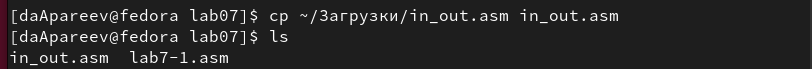
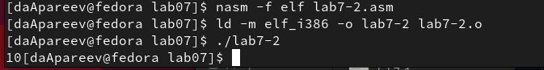

---
## Front matter
title: "Лабораторная работа №7"
subtitle: "Дисциплина: Архитектура компьютера"
author: "Апареев Дмитрий Андреевич"

## Generic otions
lang: ru-RU
toc-title: "Содержание"

## Bibliography
bibliography: bib/cite.bib
csl: pandoc/csl/gost-r-7-0-5-2008-numeric.csl

## Pdf output format
toc: true # Table of contents
toc-depth: 2
lof: true # List of figures
lot: true # List of tables
fontsize: 12pt
linestretch: 1.5
papersize: a4
documentclass: scrreprt
## I18n polyglossia
polyglossia-lang:
  name: russian
  options:
	- spelling=modern
	- babelshorthands=true
polyglossia-otherlangs:
  name: english
## I18n babel
babel-lang: russian
babel-otherlangs: english
## Fonts
mainfont: PT Serif
romanfont: PT Serif
sansfont: PT Sans
monofont: PT Mono
mainfontoptions: Ligatures=TeX
romanfontoptions: Ligatures=TeX
sansfontoptions: Ligatures=TeX,Scale=MatchLowercase
monofontoptions: Scale=MatchLowercase,Scale=0.9
## Biblatex
biblatex: true
biblio-style: "gost-numeric"
biblatexoptions:
  - parentracker=true
  - backend=biber
  - hyperref=auto
  - language=auto
  - autolang=other*
  - citestyle=gost-numeric
## Pandoc-crossref LaTeX customization
figureTitle: "Рис."
tableTitle: "Таблица"
listingTitle: "Листинг"
lofTitle: "Список иллюстраций"
lotTitle: "Список таблиц"
lolTitle: "Листинги"
## Misc options
indent: true
header-includes:
  - \usepackage{indentfirst}
  - \usepackage{float} # keep figures where there are in the text
  - \floatplacement{figure}{H} # keep figures where there are in the text
---

# Цель работы

Цель данной лабораторной работы - освоение арифметческих инструкций языка ассемблера NASM.

# Задание

1. Cимвольные и численные данные в NASM
2. Выполнение арифметических операций в NASM
3. Выполнение заданий для самостоятельной работы

# Выполнение лабораторной работы

С помощью утилиты mkdir создаю директорию, в которой буду создавать файлы с программами для лабораторной работы №7 (рис. [-@fig:001]). Перехожу в созданный каталог с помощью утилиты cd (рис. [-@fig:101])

{ #fig:001 width=70% }

{ #fig:101 width=70% }

С помощью утилиты touch создаю файл lab7-1.asm (рис. [-@fig:002]).

{ #fig:002 width=70% }

Копирую в текущий каталог файл in_out.asm с помощью утилиты cp (рис. [-@fig:003]).

{ #fig:003 width=70% }

Открываю созданный файл lab7-1.asm, вставляю в него программу вывода значения регистра eax (рис. [-@fig:004]).

{ #fig:004 width=70% }

Создаю исполняемый файл программы и запускаю его. Вывод программы: символ j, потому что программа вывела символ, соответствующий по системе ASCII сумме двоичных кодов символов 4 и 6. (рис. [-@fig:005])

{ #fig:005 width=70% }

Изменяю в тексте программы символы "6" и "4" на цифры 6 и 4 (рис. [-@fig:006]).

{ #fig:006 width=70% }

Создаю новый исполняемый файл программы и запускаю его. Теперь вывелся символ с кодом 10, это символ перевода строки, этот символ не отображается при выводе на экран.(рис. [-@fig:007])

{ #fig:007 width=70% }

Создаю новый файл lab7-2.asm с помощью утилиты touch (рис. [-@fig:008]).

{ #fig:008 width=70% } 

Ввожу в файл текст другой программы для вывода значения регистра eax (рис. [-@fig:009]).
!(image/9.png){ #fig:009 width=70% } 

Создаю и запускаю исполняемый файл lab7-2. Теперь вывод число 106, потому что программа позволяет вывести именно число, а не символ, хотя все еще происходит именно сложение кодов символов "6" и "4". (рис. [-@fig:010]).

{ #fig:010 width=70% } 

Заменяю в тексте программы в файле lab7-2.asm символы "6" и "4" на числа 6 и 4 (рис. [-@fig:011]).

{ #fig:011 width=70% } 

Создаю и запускаю новый исполняемый файл. Теперь программа складывает не соответствующие символам коды в системе ASCII, а сами числа, поэтому вывод 10. (рис. [-@fig:012])

{ #fig:012 width=70% } 

Заменяю в тексте программы функцию iprintLF на iprint (рис. [-@fig:013]).

{ #fig:013 width=70% } 

Создаю и запускаю новый исполняемый файл. Вывод не изменился, потому что символ переноса строки не отображался, когда программа исполнялась с функцией iprintLF, а iprint не добавляет к выводу символ переноса строки, в отличие от iprintLF.(рис. [-@fig:014]).

{ #fig:014 width=70% } 

Создаю файл lab7-3.asm с помощью утилиты touch (рис. [-@fig:015]).

{ #fig:015 width=70% } 

Ввожу в созданный файл текст программы для вычисления значения выражения f(x) = (5 * 2 + 3)/3 (рис. [-@fig:016]).

{ #fig:016 width=70% } 

Создаю исполняемый файл и запускаю его (рис. [-@fig:017]).

{ #fig:017 width=70% } 

Изменяю программу так, чтобы она вычисляла значение выражения f(x) = (4 * 6 + 2)/5 (рис. [-@fig:018]).

{ #fig:018 width=70% }

Создаю и запускаю новый исполняемый файл (рис. [-@fig:019]).

{ #fig:019 width=70% }

Создаю файл variant.asm с помощью утилиты touch (рис. [-@fig:020]).

{ #fig:020 width=70% }

Ввожу в файл текст программы для вычисления варианта задания по номеру студенческого билета (рис. [-@fig:021]).

{ #fig:021 width=70% }

Создаю и запускаю исполняемый файл. Ввожу номер своего студ. билета с клавиатуры, программа вывела, что мой вариант 6. (рис. [-@fig:022])

{ #fig:022 width=70% }

## Ответы на вопросы 

1. За вывод сообщения "Ваш вариант" отвечают строки кода:
	mov eax,rem
	call sprint
2. Инструкция mov ecx, x используется, чтобы положить адрес вводимой строки x в регистр ecx mov edx, 80 - запись в регистр edx длины вводимой строки call sread - вызов подпрограммы из внешнего файла, обеспечивающей ввод сообщения с клавиатуры
3. call atoi используется для вызова подпрограммы из внешнего файла, которая преобразует ascii-код символа в целое число и записывает результат в регистр eax
4. За вычисления варианта отвечают строки:
	xor edx,edx ; обнуление edx для корректной работы div
	mov ebx,20 ; ebx = 20
	div ebx ; eax = eax/20, edx - остаток от деления
	inc edx ; edx = edx + 1
5. При выполнении инструкции div ebx остаток от деления записывается в регистр edx
6. Инструкция inc edx увеличивает значение регистра edx на 1
7. За вывод на экран результатов вычислений отвечают строки:
	mov eax,edx
	call iprintLF
	
Открываю файл report.md с помощью любого текстового редактора gedit. Компилирую файл с отчетом. Загружаю отчет на GitHub.

# Задания для самостоятельной работы

Создаю файл lab7-4.asm с помощью утилиты touch (рис. [-@fig:023]).

{ #fig:023 width=70% } 

Открываю созданный файл для редактирования, ввожу в него текст программы для вычисления значения выражения x^3 / 2 + 1 (рис. [-@fig:024]). 

{ #fig:024 width=70% } 

Создаю и запускаю исполняемый файл (рис. [-@fig:025])

{ #fig:025 width=70% } 

Добавляю файлы в git , Сохраняю файлы в git , Отправляю файлы на сервер 

# Вывод

При выполнении данной лабораторной работы я освоил арифметические инструкции языка ассемблера NASM.

